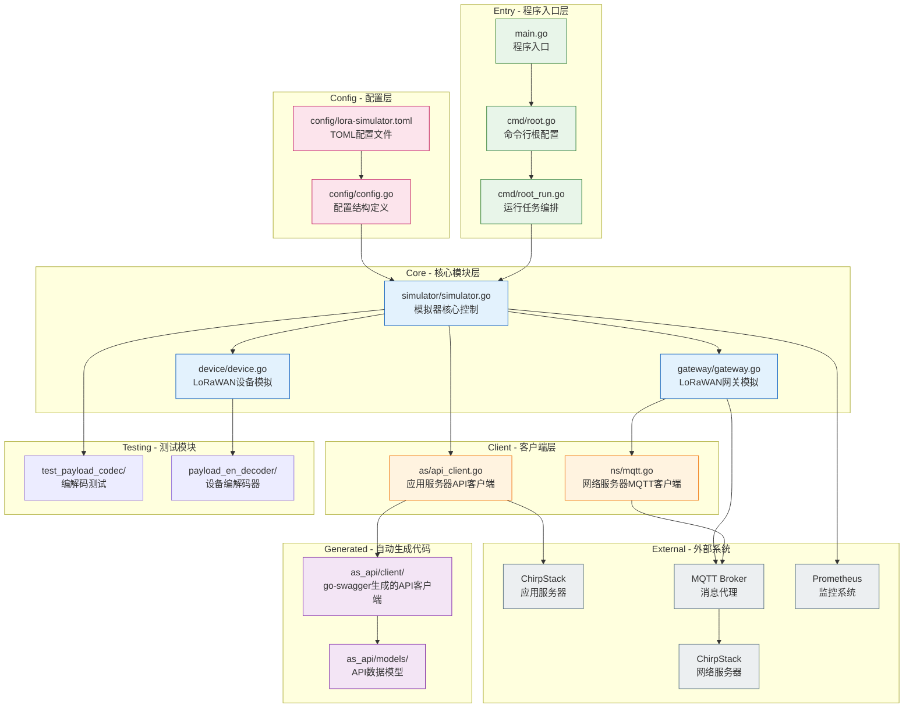
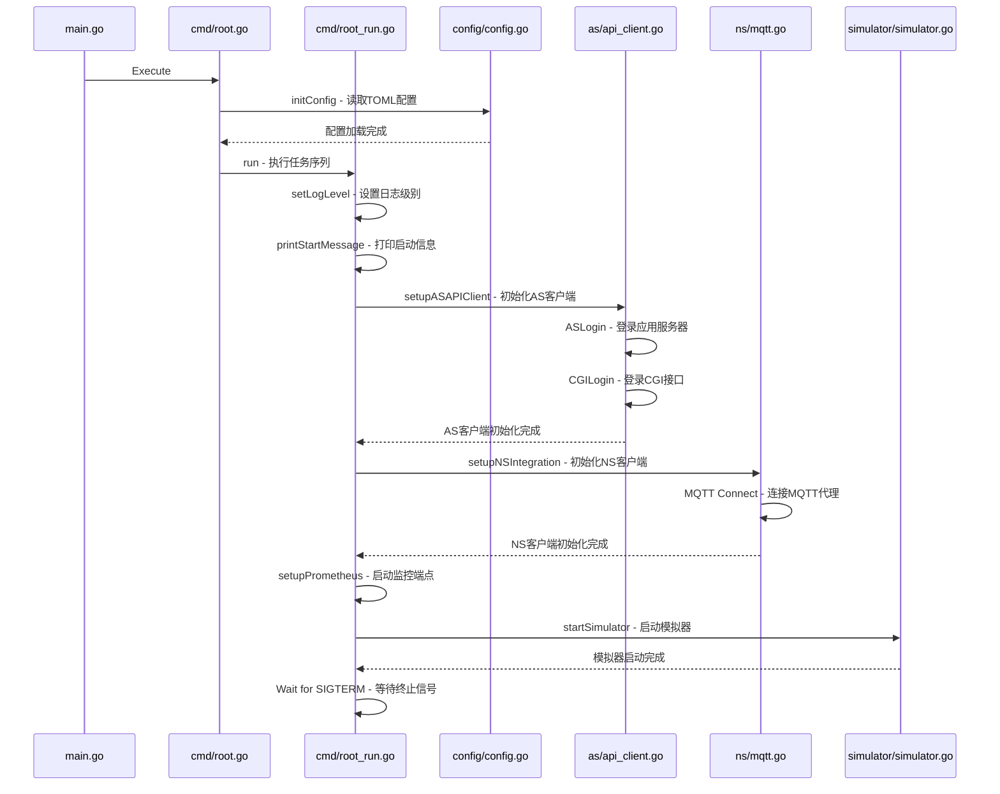
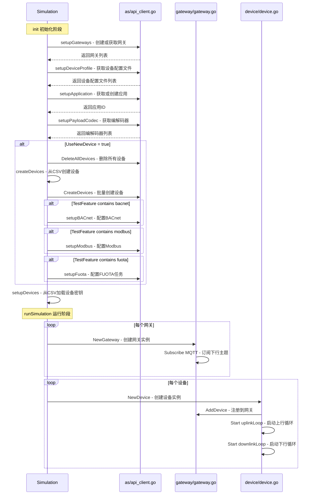
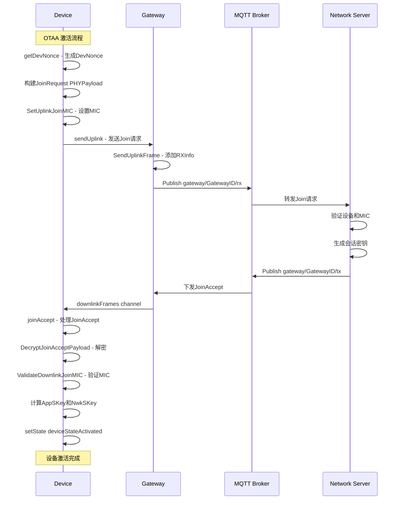
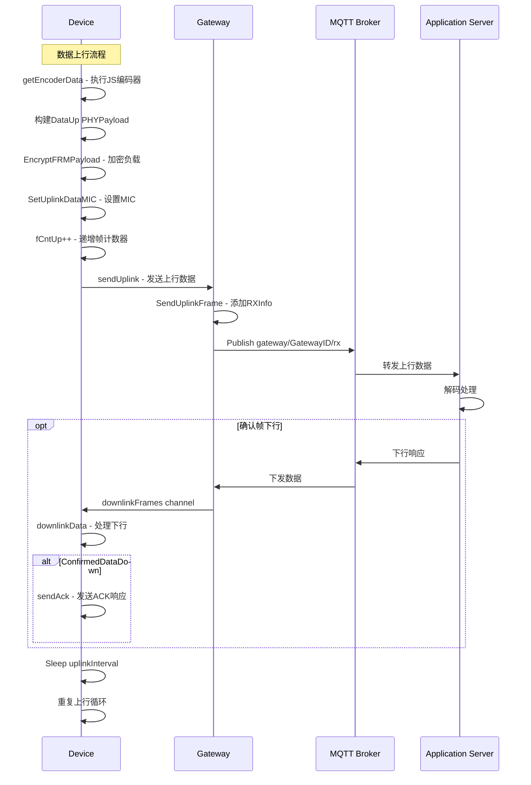
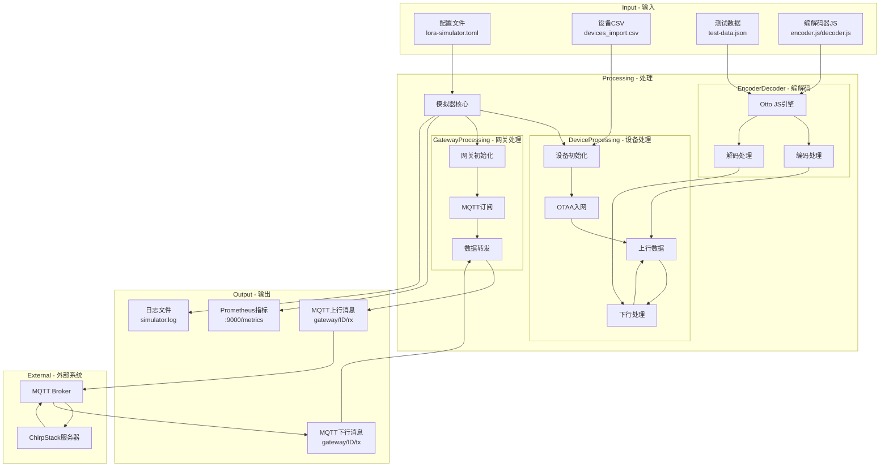
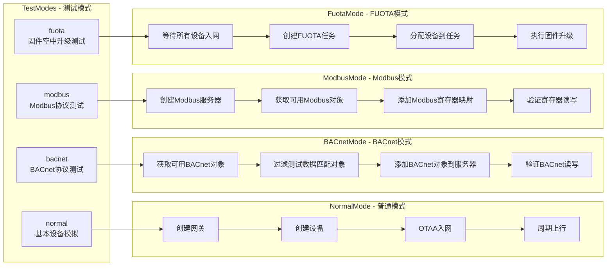
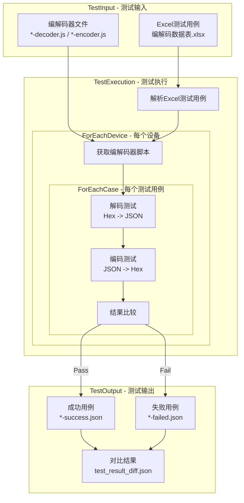
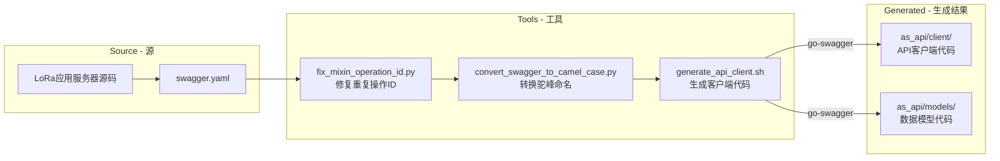

# LoRa-Simulator 项目架构概述文档

## 1. 项目概述

LoRa-Simulator 是一个用 Go 语言开发的 LoRaWAN 设备和网关模拟器，主要用于测试 ChirpStack 应用服务器的功能和性能。该项目可以模拟大量 LoRaWAN 设备的入网、数据上传、下发等场景，支持 FUOTA（固件空中升级）、BACnet、Modbus 等高级功能的测试。

### 1.1 技术栈

- **编程语言**: Go 1.23.0+
- **协议支持**: LoRaWAN 1.0.x, MQTT
- **外部依赖**: 
  - [`github.com/brocaar/lorawan`](go.mod:8) - LoRaWAN 协议实现
  - [`github.com/eclipse/paho.mqtt.golang`](go.mod:10) - MQTT 客户端
  - [`github.com/spf13/cobra`](go.mod:23) - 命令行框架
  - [`github.com/spf13/viper`](go.mod:24) - 配置管理
  - [`github.com/go-openapi/runtime`](go.mod:12) - REST API 客户端
  - [`github.com/prometheus/client_golang`](go.mod:20) - 监控指标

## 2. 整体架构图



## 3. 主要流程图

### 3.1 程序启动流程



### 3.2 模拟器初始化流程



### 3.3 设备入网流程 - OTAA



### 3.4 数据上行流程



## 4. 目录结构详解

```
lora-simulator-stable/
├── cmd/                              # 命令行入口
│   └── lora-simulator/
│       ├── main.go                   # 程序入口点
│       ├── cmd/                      # 命令行处理
│       │   ├── root.go               # 根命令定义和配置初始化
│       │   ├── root_run.go           # 主运行逻辑和任务编排
│       │   ├── configfile.go         # 配置文件操作
│       │   └── version.go            # 版本信息
│       ├── config/                   # 配置文件目录
│       │   ├── lora-simulator.toml   # 主配置文件
│       │   ├── devices_dynamic.json  # 动态设备配置
│       │   └── base_devices_export.csv # 基础设备模板
│       └── payload_en_decoder/       # 编解码器脚本
│           ├── decoder.js            # 解码器脚本
│           ├── test-data.json        # 测试数据
│           └── codec-release/        # 各厂商编解码器
│               └── vendors/milesight-iot/
│
├── internal/                         # 内部包
│   ├── simulator/                    # 模拟器核心
│   │   └── simulator.go              # 模拟控制逻辑
│   ├── device/                       # 设备模拟
│   │   └── device.go                 # LoRaWAN设备实现
│   ├── gateway/                      # 网关模拟
│   │   └── gateway.go                # LoRaWAN网关实现
│   ├── deviceconfig/                 # 设备配置管理（新）
│   │   ├── types.go                  # 类型定义
│   │   ├── registry.go               # 设备类型注册表
│   │   └── loader.go                 # 配置加载器
│   ├── as/                           # 应用服务器客户端
│   │   ├── api_client.go             # API客户端封装
│   │   └── loadcsv.go                # CSV设备配置加载
│   ├── ns/                           # 网络服务器客户端
│   │   └── mqtt.go                   # MQTT客户端
│   ├── config/                       # 配置管理
│   │   └── config.go                 # 配置结构定义
│   ├── as_api/                       # 自动生成的API客户端
│   │   ├── client/                   # go-swagger生成的客户端代码
│   │   └── models/                   # API数据模型
│   ├── test_payload_codec/           # 编解码测试
│   │   └── test_payload_codec.go     # 测试执行逻辑
│   ├── utils/                        # 工具函数
│   ├── fragmentation/                # FUOTA分片处理
│   └── multicastsetup/               # 组播设置
│
├── api_tools/                        # API工具链
│   ├── generate_api_client.sh        # API客户端生成脚本
│   ├── fix_mixin_operation_id.py     # 修复swagger操作ID
│   └── convert_swagger_to_camel_case.py # 驼峰命名转换
│
├── guide/                            # 项目文档
│   ├── lora-simulator架构与开发指南.md
│   └── 编解码测试指南.md
│
├── go.mod                            # Go模块定义
└── go.sum                            # 依赖校验和
```

## 5. 核心模块详解

### 5.1 程序入口 - [`cmd/lora-simulator/main.go`](cmd/lora-simulator/main.go:1)

```go
func main() {
    // 初始化日志文件
    file, _ := os.OpenFile("simulator.log", ...)
    logrus.SetOutput(file)
    
    // 执行命令行
    cmd.Execute(version)
}
```

**职责**：
- 初始化日志输出到文件 `simulator.log`
- 调用命令行处理模块启动程序

### 5.2 命令行处理 - [`cmd/lora-simulator/cmd/root.go`](cmd/lora-simulator/cmd/root.go:1)

**核心函数**:
- [`Execute()`](cmd/lora-simulator/cmd/root.go:17) - 执行根命令
- [`initConfig()`](cmd/lora-simulator/cmd/root.go:48) - 初始化配置

**配置加载流程**:
1. 读取命令行参数指定的配置文件或默认位置
2. 使用 Viper 解析 TOML 配置
3. 反序列化到 [`config.C`](internal/config/config.go:116) 全局变量

### 5.3 任务编排 - [`cmd/lora-simulator/cmd/root_run.go`](cmd/lora-simulator/cmd/root_run.go:1)

**启动任务序列**:
```go
tasks := []func(context.Context, *sync.WaitGroup) error{
    setLogLevel,           // 设置日志级别
    printStartMessage,     // 打印启动信息
    setupASAPIClient,      // 初始化AS API客户端
    setupASIntegration,    // AS集成设置
    setupNSIntegration,    // NS MQTT连接
    setupPrometheus,       // Prometheus监控端点
    startPayloadCodecTest, // 编解码测试(可选)
    startSimulator,        // 启动模拟器
}
```

### 5.4 模拟器核心 - [`internal/simulator/simulator.go`](internal/simulator/simulator.go:1)

**核心结构体** - [`Simulation`](internal/simulator/simulator.go:90):
```go
type Simulation struct {
    ctx             context.Context
    wg              *sync.WaitGroup
    tenantID        string
    deviceCount     int
    gatewayMinCount int
    gatewayMaxCount int
    duration        time.Duration
    // ... 其他字段
    deviceAppKeys   map[lorawan.EUI64]lorawan.AES128Key
    euiCodecMap     map[lorawan.EUI64]*models.APIPayloadCodecItem
}
```

**主要方法**:
- [`Start()`](internal/simulator/simulator.go:47) - 启动模拟器
- [`init()`](internal/simulator/simulator.go:149) - 初始化资源
- [`runSimulation()`](internal/simulator/simulator.go:221) - 运行模拟
- [`tearDown()`](internal/simulator/simulator.go:199) - 清理资源

**高级功能设置**:
- [`setupBACnet()`](internal/simulator/simulator.go:682) - BACnet协议配置
- [`setupModbus()`](internal/simulator/simulator.go:822) - Modbus协议配置
- [`setupFuota()`](internal/simulator/simulator.go:750) - FUOTA任务配置

**多设备类型支持** (新功能):
- [`generateMultiTypeDevices()`](internal/simulator/simulator.go:591) - 从 simulation-config.json 生成多种设备类型

### 5.5 设备配置管理 - [`internal/deviceconfig/`](internal/deviceconfig/)

这是新增的模块，用于支持多设备类型配置。

**核心类型** - [`types.go`](internal/deviceconfig/types.go:1):
```go
// DeviceTypeConfig 设备类型配置
type DeviceTypeConfig struct {
    ID            string            `json:"id"`
    Name          string            `json:"name"`
    TestData      string            `json:"test_data"`
    DefaultFPort  int               `json:"default_fport"`
    EncoderScript string            `json:"encoder_script"`
    Simulation    SimulationDefault `json:"simulation"`
    // ...
}

// DeviceInstance 运行时设备实例
type DeviceInstance struct {
    DevEUI         string
    Name           string
    AppKey         string
    DeviceType     *DeviceTypeConfig
    TestData       map[string]interface{}
    EncoderScript  string
    // ...
}
```

**设备类型注册表** - [`registry.go`](internal/deviceconfig/registry.go:1):
```go
type DeviceTypeRegistry struct {
    deviceTypes map[string]*DeviceTypeConfig  // by ID
    byName      map[string]*DeviceTypeConfig  // by Name
}

// 主要方法:
// - Register() - 注册设备类型
// - Get() - 按ID或名称获取设备类型
// - GetAll() - 获取所有设备类型
// - GetEnabled() - 获取启用的设备类型
```

**配置加载器** - [`loader.go`](internal/deviceconfig/loader.go:1):
```go
type DeviceConfigLoader struct {
    baseDir     string
    devicesJSON *DevicesJSON
    simConfig   *SimulationConfig
    registry    *DeviceTypeRegistry
}

// 主要方法:
// - Load() - 加载配置
// - GenerateDeviceInstances() - 生成设备实例
// - GetDeviceTypeByPayloadCodec() - 按编解码器名称查找设备类型
```

### 5.6 设备模拟 - [`internal/device/device.go`](internal/device/device.go:1)

**核心结构体** - [`Device`](internal/device/device.go:80):
```go
type Device struct {
    sync.RWMutex
    ctx            context.Context
    devEUI         lorawan.EUI64
    appKey         lorawan.AES128Key
    devAddr        lorawan.DevAddr
    appSKey        lorawan.AES128Key
    nwkSKey        lorawan.AES128Key
    fCntUp         uint32
    fCntDown       uint32
    state          deviceState  // OTAA or Activated
    gateways       []*gateway.Gateway
    payloadCodec   *models.APIPayloadCodecItem
    // ...
}
```

**设备选项模式** (Option Pattern):
- [`WithDevEUI()`](internal/device/device.go:230) - 设置DevEUI
- [`WithAppKey()`](internal/device/device.go:222) - 设置AppKey
- [`WithGateways()`](internal/device/device.go:282) - 关联网关
- [`WithPayloadCodec()`](internal/device/device.go:317) - 设置编解码器
- [`WithDeviceTypeConfig()`](internal/device/device.go:324) - 设置设备类型配置（新）
- [`WithDeviceTestData()`](internal/device/device.go:345) - 设置设备特定测试数据（新）

**核心循环**:
- [`uplinkLoop()`](internal/device/device.go:358) - 上行数据循环
- [`downlinkLoop()`](internal/device/device.go:418) - 下行处理循环

**协议处理**:
- [`joinRequest()`](internal/device/device.go:453) - 发送入网请求
- [`joinAccept()`](internal/device/device.go:691) - 处理入网响应
- [`dataUp()`](internal/device/device.go:605) - 发送上行数据
- [`downlinkData()`](internal/device/device.go:761) - 处理下行数据

### 5.6 网关模拟 - [`internal/gateway/gateway.go`](internal/gateway/gateway.go:1)

**核心结构体** - [`Gateway`](internal/gateway/gateway.go:28):
```go
type Gateway struct {
    mqtt      mqtt.Client
    gatewayID lorawan.EUI64
    devices   map[lorawan.EUI64]chan *gw.DownlinkFrame
    
    eventTopicTemplate   *template.Template
    commandTopicTemplate *template.Template
    // ...
}
```

**主要功能**:
- [`NewGateway()`](internal/gateway/gateway.go:346) - 创建网关并订阅MQTT
- [`SendUplinkFrame()`](internal/gateway/gateway.go:379) - 发送上行帧
- [`AddDevice()`](internal/gateway/gateway.go:445) - 注册设备
- [`downlinkEventHandler()`](internal/gateway/gateway.go:485) - 处理下行事件

**频率计划支持**:
```go
var txInfoMap = map[string]TXInfo{
    "AS923-1", "AS923-2", "AS923-3", "AS923-4",
    "AU915", "CN470", "KR920", "EU868", "IN865", "RU864", "AS915"
}
```

### 5.7 应用服务器客户端 - [`internal/as/api_client.go`](internal/as/api_client.go:1)

**认证方式**:
- [`ASLogin()`](internal/as/api_client.go:264) - JWT登录
- [`CGILogin()`](internal/as/api_client.go:194) - CGI Cookie登录

**主要API操作**:
| 函数 | 功能 |
|------|------|
| [`CreateApplication()`](internal/as/api_client.go:287) | 创建应用 |
| [`CreateGateway()`](internal/as/api_client.go:315) | 创建网关 |
| [`CreateDeviceProfile()`](internal/as/api_client.go:350) | 创建设备配置文件 |
| [`CreateDevices()`](internal/as/api_client.go:396) | 创建设备 |
| [`GetPayloadCoedc()`](internal/as/api_client.go:456) | 获取编解码器列表 |
| [`AddBACnetObjects()`](internal/as/api_client.go:638) | 添加BACnet对象 |
| [`CreateModbusServer()`](internal/as/api_client.go:711) | 创建Modbus服务器 |
| [`CreateFuotaTask()`](internal/as/api_client.go:663) | 创建FUOTA任务 |

### 5.8 网络服务器MQTT客户端 - [`internal/ns/mqtt.go`](internal/ns/mqtt.go:1)

```go
func Setup(c config.Config) error {
    // 连接MQTT代理
    opts := mqtt.NewClientOptions()
    opts.AddBroker(conf.Server)
    opts.SetUsername(conf.Username)
    opts.SetPassword(conf.Password)
    
    mqttClient = mqtt.NewClient(opts)
    mqttClient.Connect()
}

func Client() mqtt.Client {
    return mqttClient  // 提供给网关使用
}
```

### 5.9 配置结构 - [`internal/config/config.go`](internal/config/config.go:1)

**主配置结构**:
```go
type Config struct {
    General struct {
        LogLevel    int
        ChannelPlan string  // EU868, AS923-1, CN470等
    }
    
    LoraSimulator struct {
        API struct {
            Server, Username, Password string
            UseNewDevice bool
            TestFeature string  // "normal,bacnet,fuota,modbus"
        }
        Integration struct { MQTT MQTTConfig }
        Gateway struct { Backend struct { MQTT MQTTConfig } }
        TestPayloadCodec struct { /* 编解码测试配置 */ }
    }
    
    Simulator []struct {
        TenantID  string
        Duration  time.Duration
        Device    DeviceConfig
        Gateway   GatewayConfig
    }
    
    Prometheus struct { Bind string }
}
```

## 6. 数据流架构图



## 7. 测试模式架构



## 8. 编解码测试架构



## 9. API工具链架构



## 10. 监控指标

模拟器通过 Prometheus 暴露以下指标（端口 9000）:

| 指标名 | 类型 | 描述 |
|--------|------|------|
| `device_join_request_total` | Counter | 设备入网请求总数 |
| `device_join_accept_total` | Counter | 设备入网成功总数 |
| `device_uplink_total` | Counter | 设备上行数据总数 |
| `gateway_uplink_total` | Counter | 网关转发上行总数 |
| `gateway_downlink_total` | Counter | 网关接收下行总数 |

## 11. 配置文件说明

### 11.1 主配置文件结构

```toml
[general]
log_level = 4          # debug=5, info=4, warning=3, error=2
channel_plan = "EU868" # 频率计划

[lora-simulator.api]
server = "192.168.40.148"
username = "admin"
password = "password1"
use_new_device = true   # 是否创建新设备
test_feature = "normal,bacnet"  # 测试功能列表

[lora-simulator.integration.mqtt]
server = "tcp://192.168.40.148:1883"
username = "lorawan"
password = "xxx"

[[simulator]]
tenant_id = "f6f7d81d-..."
duration = "0s"         # 0表示无限运行
sequence_join = true    # 串行入网
sequence_join_interval = "2s"

[simulator.device]
count = 1
uplink_interval = "300s"
f_port = 1
payload = "010203"

[simulator.gateway]
min_count = 3
max_count = 5
event_topic_template = "gateway/{{ .GatewayID }}/rx"
command_topic_template = "gateway/{{ .GatewayID }}/tx"

[prometheus]
bind = "0.0.0.0:9000"
```

## 12. 快速开始

### 12.1 编译运行

```bash
# 编译
go build -o lora-simulator ./cmd/lora-simulator

# 运行
cd cmd/lora-simulator
./lora-simulator -c config/lora-simulator.toml
```

### 12.2 配置步骤

1. 修改 `lora-simulator.toml` 中的服务器地址和认证信息
2. 准备设备配置 CSV 文件（基于 `base_devices_export.csv`）
3. 配置测试功能（normal/bacnet/modbus/fuota）
4. 启动模拟器

### 12.3 查看日志和指标

```bash
# 查看日志
tail -f simulator.log

# 查看Prometheus指标
curl http://localhost:9000/metrics
```

## 13. 扩展开发指南

### 13.1 配置多设备类型仿真

1. 确保 [`devices.json`](cmd/lora-simulator/payload_en_decoder/codec-release/vendors/milesight-iot/devices.json) 包含设备类型定义
2. 创建 [`simulation-config.json`](cmd/lora-simulator/config/simulation-config.json) 指定设备类型和数量
3. 可选：为每个设备类型创建测试数据文件（如 `vs330-test-data.json`）
4. 运行模拟器

详见 [多设备类型配置迁移指南](migration-guide-multi-device-type.md)

### 13.2 添加新的测试功能

1. 在 [`internal/simulator/simulator.go`](internal/simulator/simulator.go) 中添加 `setup*()` 方法
2. 在 [`internal/config/config.go`](internal/config/config.go) 中添加配置项
3. 在 [`init()`](internal/simulator/simulator.go:149) 方法中调用新功能

### 13.3 支持新的设备编解码器

1. 在 `payload_en_decoder/codec-release/vendors/` 下添加厂商目录
2. 提供 `*-encoder.js` 和 `*-decoder.js` 文件
3. 可选：添加设备特定测试数据 `*-test-data.json`
4. 在 `devices.json` 中注册新设备类型并添加 `test_data`、`default_fport`、`simulation` 字段

### 13.4 扩展API客户端

1. 更新 swagger 文档
2. 运行 `api_tools/generate_api_client.sh`
3. 在 [`internal/as/api_client.go`](internal/as/api_client.go) 中封装新API

---

*文档生成时间: 2024年12月*
*项目版本: lora-simulator-stable*