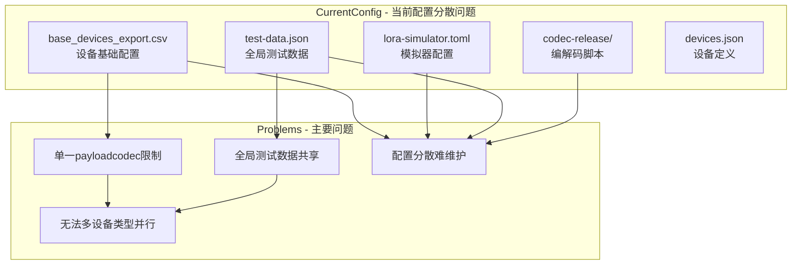
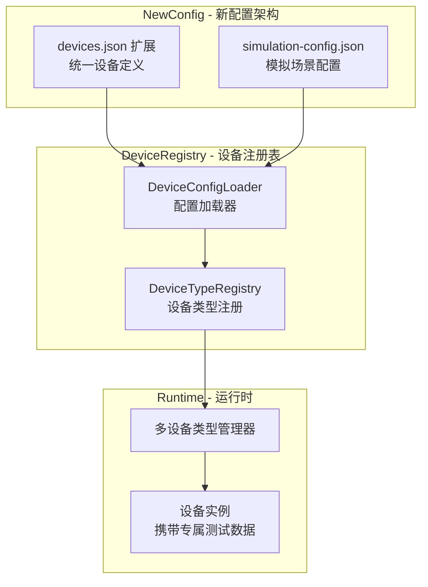
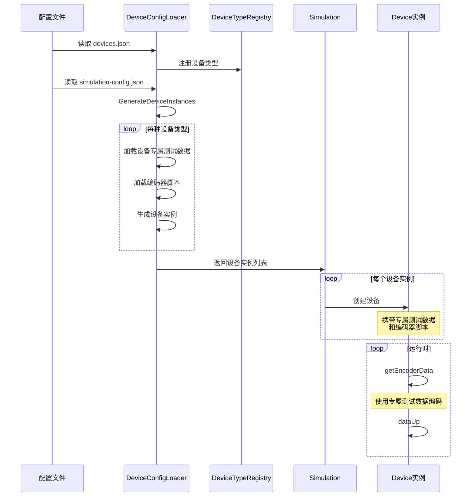

# LoRa Simulator 设备配置优化方案

## 1. 问题分析

### 1.1 当前配置结构（分散）



### 1.2 问题详细说明

| 问题 | 当前实现 | 影响 |
|------|----------|------|
| **配置分散** | CSV存设备信息、TOML存模拟参数、JSON存测试数据 | 维护困难，关联关系不清晰 |
| **单一payloadcodec** | `generateDevices()` 从单一模板生成所有设备 | 一次只能模拟一种设备类型 |
| **全局测试数据** | `TEST_DATA_PATH` 是硬编码常量 | 所有设备用同一份测试数据 |
| **设备专属测试数据未利用** | 存在 `wt201-test-data.json` 但未使用 | 浪费已有资源 |

## 2. 优化方案设计

### 2.1 新架构概览



### 2.2 扩展后的 devices.json Schema

```json
{
    "version": "2.0.0",
    "devices": [
        {
            "id": "vs330",
            "name": "VS330",
            "description": "Bathroom Occupancy Sensor",
            "catalog": "vs",
            "sn": "6617",
            "deveui_prefix": "24e124617",
            "device_profile": ["ClassA-OTAA"],
            "codec": "vendors/milesight-iot/vs330/vs330-codec.json",
            "decoder_script": "vendors/milesight-iot/vs330/vs330-decoder.js",
            "encoder_script": "vendors/milesight-iot/vs330/vs330-encoder.js",
            "test_data": "vendors/milesight-iot/vs330/vs330-test-data.json",
            "default_fport": 1,
            "simulation": {
                "enabled": true,
                "default_count": 10,
                "uplink_interval": "300s"
            }
        }
    ]
}
```

**新增字段说明：**

| 字段 | 类型 | 说明 |
|------|------|------|
| `test_data` | string | 设备专属测试数据文件路径 |
| `default_fport` | int | 默认FPort |
| `simulation.enabled` | bool | 是否在模拟中启用该设备类型 |
| `simulation.default_count` | int | 默认模拟设备数量 |
| `simulation.uplink_interval` | string | 上行间隔 |

### 2.3 新增 simulation-config.json

```json
{
    "version": "1.0.0",
    "simulation": {
        "name": "multi-device-test",
        "duration": "0s",
        "activation_time": "60s",
        "sequence_join": true,
        "sequence_join_interval": "2s"
    },
    "device_types": [
        {
            "device_id": "vs330",
            "count": 5,
            "uplink_interval": "120s",
            "test_data_override": null
        },
        {
            "device_id": "wt201",
            "count": 3,
            "uplink_interval": "180s",
            "test_data_override": "custom-wt201-data.json"
        },
        {
            "device_id": "am107",
            "count": 2,
            "uplink_interval": "300s"
        }
    ]
}
```

> **注意**：Gateway 配置仍然保留在 `lora-simulator.toml` 中，不在此文件重复配置。

## 3. 实现方案

### 3.1 新增模块结构

```
internal/
├── deviceconfig/                    # 新增: 设备配置管理模块
│   ├── loader.go                    # 配置加载器
│   ├── registry.go                  # 设备类型注册表
│   ├── types.go                     # 类型定义
│   └── validator.go                 # 配置验证器
├── device/
│   └── device.go                    # 修改: 支持设备专属测试数据
└── simulator/
    └── simulator.go                 # 修改: 支持多设备类型
```

### 3.2 核心类型定义 (types.go)

```go
package deviceconfig

import "time"

// DeviceTypeConfig 设备类型配置（来自扩展后的devices.json）
type DeviceTypeConfig struct {
    ID            string            `json:"id"`
    Name          string            `json:"name"`
    Description   string            `json:"description"`
    Catalog       string            `json:"catalog"`
    SN            string            `json:"sn"`
    DevEUIPrefix  string            `json:"deveui_prefix"`
    DeviceProfile []string          `json:"device_profile"`
    Codec         string            `json:"codec"`
    DecoderScript string            `json:"decoder_script"`
    EncoderScript string            `json:"encoder_script"`
    TestData      string            `json:"test_data"`
    DefaultFPort  int               `json:"default_fport"`
    Simulation    SimulationDefault `json:"simulation"`
}

// SimulationDefault 设备类型的默认模拟配置
type SimulationDefault struct {
    Enabled        bool   `json:"enabled"`
    DefaultCount   int    `json:"default_count"`
    UplinkInterval string `json:"uplink_interval"`
}

// SimulationConfig 模拟场景配置（simulation-config.json）
type SimulationConfig struct {
    Version     string                `json:"version"`
    Simulation  SimulationParams      `json:"simulation"`
    DeviceTypes []DeviceTypeInstance  `json:"device_types"`
}

// SimulationParams 模拟参数
type SimulationParams struct {
    Name                 string `json:"name"`
    Duration             string `json:"duration"`
    ActivationTime       string `json:"activation_time"`
    SequenceJoin         bool   `json:"sequence_join"`
    SequenceJoinInterval string `json:"sequence_join_interval"`
}

// DeviceTypeInstance 设备类型实例配置
type DeviceTypeInstance struct {
    DeviceID         string  `json:"device_id"`
    Count            int     `json:"count"`
    UplinkInterval   string  `json:"uplink_interval"`
    TestDataOverride *string `json:"test_data_override"`
}

// DeviceInstance 运行时设备实例
type DeviceInstance struct {
    DevEUI         string
    Name           string
    DeviceType     *DeviceTypeConfig
    TestData       map[string]interface{}
    EncoderScript  string
    FPort          int
    UplinkInterval time.Duration
}
```

### 3.3 配置加载器 (loader.go)

```go
package deviceconfig

import (
    "encoding/json"
    "fmt"
    "os"
    "path/filepath"
)

const (
    DefaultDevicesJSONPath    = "payload_en_decoder/codec-release/vendors/milesight-iot/devices.json"
    DefaultSimConfigPath      = "config/simulation-config.json"
    CodecBaseDir              = "payload_en_decoder/codec-release/"
)

type DeviceConfigLoader struct {
    baseDir     string
    devicesJSON *DevicesJSON
    simConfig   *SimulationConfig
    registry    *DeviceTypeRegistry
}

// NewDeviceConfigLoader 创建配置加载器
func NewDeviceConfigLoader(baseDir string) *DeviceConfigLoader {
    return &DeviceConfigLoader{
        baseDir:  baseDir,
        registry: NewDeviceTypeRegistry(),
    }
}

// Load 加载所有配置
func (l *DeviceConfigLoader) Load() error {
    // 1. 加载 devices.json
    if err := l.loadDevicesJSON(); err != nil {
        return fmt.Errorf("load devices.json failed: %w", err)
    }
    
    // 2. 注册所有设备类型
    for _, device := range l.devicesJSON.Devices {
        l.registry.Register(device)
    }
    
    // 3. 加载模拟配置（如果存在）
    simConfigPath := filepath.Join(l.baseDir, DefaultSimConfigPath)
    if _, err := os.Stat(simConfigPath); err == nil {
        if err := l.loadSimulationConfig(simConfigPath); err != nil {
            return fmt.Errorf("load simulation config failed: %w", err)
        }
    }
    
    return nil
}

// GenerateDeviceInstances 根据模拟配置生成设备实例
func (l *DeviceConfigLoader) GenerateDeviceInstances() ([]*DeviceInstance, error) {
    var instances []*DeviceInstance
    
    for _, typeInstance := range l.simConfig.DeviceTypes {
        deviceType := l.registry.Get(typeInstance.DeviceID)
        if deviceType == nil {
            return nil, fmt.Errorf("unknown device type: %s", typeInstance.DeviceID)
        }
        
        // 加载测试数据
        testDataPath := deviceType.TestData
        if typeInstance.TestDataOverride != nil {
            testDataPath = *typeInstance.TestDataOverride
        }
        
        testData, err := l.loadTestData(testDataPath)
        if err != nil {
            return nil, fmt.Errorf("load test data for %s failed: %w", typeInstance.DeviceID, err)
        }
        
        // 加载编码器脚本
        encoderScript, err := l.loadEncoderScript(deviceType.EncoderScript)
        if err != nil {
            return nil, fmt.Errorf("load encoder script for %s failed: %w", typeInstance.DeviceID, err)
        }
        
        // 生成设备实例
        for i := 0; i < typeInstance.Count; i++ {
            instance := &DeviceInstance{
                DevEUI:         l.generateDevEUI(deviceType.DevEUIPrefix, i),
                Name:           fmt.Sprintf("%s-%d", deviceType.Name, i+1),
                DeviceType:     deviceType,
                TestData:       testData,
                EncoderScript:  encoderScript,
                FPort:          deviceType.DefaultFPort,
                UplinkInterval: l.parseInterval(typeInstance.UplinkInterval),
            }
            instances = append(instances, instance)
        }
    }
    
    return instances, nil
}

func (l *DeviceConfigLoader) loadTestData(path string) (map[string]interface{}, error) {
    fullPath := filepath.Join(l.baseDir, CodecBaseDir, path)
    
    data, err := os.ReadFile(fullPath)
    if err != nil {
        // 如果设备专属测试数据不存在，尝试加载默认测试数据
        defaultPath := filepath.Join(l.baseDir, "payload_en_decoder/test-data.json")
        data, err = os.ReadFile(defaultPath)
        if err != nil {
            return nil, err
        }
    }
    
    var testData map[string]interface{}
    if err := json.Unmarshal(data, &testData); err != nil {
        return nil, err
    }
    
    return testData, nil
}
```

### 3.4 设备类型注册表 (registry.go)

```go
package deviceconfig

import "sync"

// DeviceTypeRegistry 设备类型注册表
type DeviceTypeRegistry struct {
    mu      sync.RWMutex
    devices map[string]*DeviceTypeConfig
}

func NewDeviceTypeRegistry() *DeviceTypeRegistry {
    return &DeviceTypeRegistry{
        devices: make(map[string]*DeviceTypeConfig),
    }
}

func (r *DeviceTypeRegistry) Register(device DeviceTypeConfig) {
    r.mu.Lock()
    defer r.mu.Unlock()
    r.devices[device.ID] = &device
}

func (r *DeviceTypeRegistry) Get(id string) *DeviceTypeConfig {
    r.mu.RLock()
    defer r.mu.RUnlock()
    return r.devices[id]
}

func (r *DeviceTypeRegistry) GetAll() []*DeviceTypeConfig {
    r.mu.RLock()
    defer r.mu.RUnlock()
    
    result := make([]*DeviceTypeConfig, 0, len(r.devices))
    for _, device := range r.devices {
        result = append(result, device)
    }
    return result
}

func (r *DeviceTypeRegistry) GetEnabled() []*DeviceTypeConfig {
    r.mu.RLock()
    defer r.mu.RUnlock()
    
    result := make([]*DeviceTypeConfig, 0)
    for _, device := range r.devices {
        if device.Simulation.Enabled {
            result = append(result, device)
        }
    }
    return result
}
```

### 3.5 修改 Device 结构体 (device.go)

```go
// 在 Device 结构体中添加新字段
type Device struct {
    // ... 现有字段 ...
    
    // 新增字段
    deviceTypeConfig *deviceconfig.DeviceTypeConfig
    testData         map[string]interface{}  // 设备专属测试数据
    encoderScript    string                   // 编码器脚本内容
}

// 新增 Option
func WithDeviceTypeConfig(config *deviceconfig.DeviceTypeConfig) DeviceOption {
    return func(d *Device) error {
        d.deviceTypeConfig = config
        return nil
    }
}

func WithTestData(testData map[string]interface{}) DeviceOption {
    return func(d *Device) error {
        d.testData = testData
        return nil
    }
}

func WithEncoderScript(script string) DeviceOption {
    return func(d *Device) error {
        d.encoderScript = script
        return nil
    }
}

// 修改 getEncoderData 方法
func (d *Device) getEncoderData() {
    // 使用设备专属测试数据而非全局数据
    if d.testData == nil {
        log.Warnf("device %s has no test data", d.devEUI)
        return
    }
    
    // 使用预加载的编码器脚本
    if d.encoderScript == "" {
        log.Warnf("device %s has no encoder script", d.devEUI)
        return
    }
    
    bytes, err := d.encodePayloadWithData(d.encoderScript, d.testData)
    if err != nil {
        log.Errorf("encode payload error: %v", err)
        return
    }
    
    d.payload = bytes
    d.dynamicPayload = bytes
    d.fPort = uint8(d.deviceTypeConfig.DefaultFPort)
}

// 新方法：使用指定的测试数据编码
func (d *Device) encodePayloadWithData(encoderScript string, testData map[string]interface{}) ([]byte, error) {
    vm := otto.New()
    
    if _, err := vm.Run(encoderScript); err != nil {
        return nil, fmt.Errorf("execute encoder script error: %v", err)
    }
    
    encode, err := vm.Get("Encode")
    if err != nil {
        return nil, fmt.Errorf("get encode function error: %v", err)
    }
    
    result, err := encode.Call(otto.NullValue(), nil, testData)
    if err != nil {
        return nil, fmt.Errorf("call encode function error: %v", err)
    }
    
    // ... 转换结果为字节数组 ...
    return bytes, nil
}
```

### 3.6 修改 Simulator (simulator.go)

```go
// 修改 Simulation 结构体
type Simulation struct {
    // ... 现有字段 ...
    
    // 新增字段
    deviceConfigLoader *deviceconfig.DeviceConfigLoader
    deviceInstances    []*deviceconfig.DeviceInstance
}

// 修改 createDevices 方法
func (s *Simulation) createDevices() error {
    // 使用新的配置加载器
    s.deviceConfigLoader = deviceconfig.NewDeviceConfigLoader(".")
    if err := s.deviceConfigLoader.Load(); err != nil {
        return err
    }
    
    // 生成设备实例
    instances, err := s.deviceConfigLoader.GenerateDeviceInstances()
    if err != nil {
        return err
    }
    s.deviceInstances = instances
    
    // 为每个实例创建设备
    for _, instance := range instances {
        // 查找或创建 profile、application、payloadCodec
        profileID := s.findProfileID(instance.DeviceType.DeviceProfile[0])
        applicationID := s.findApplicationID()
        payloadCodecID := s.findPayloadCodecID(instance.DeviceType.Name)
        
        // 生成 AppKey
        appKey := generateRandomString()
        
        // 调用 API 创建设备
        err := as.CreateDevices(
            instance.DevEUI,
            instance.Name,
            profileID,
            appKey,
            payloadCodecID,
            applicationID,
        )
        if err != nil {
            log.Errorf("create device %s failed: %v", instance.DevEUI, err)
            continue
        }
        
        // 保存设备密钥映射
        var devEUI lorawan.EUI64
        devEUI.UnmarshalText([]byte(instance.DevEUI))
        var appKeyAES lorawan.AES128Key
        appKeyAES.UnmarshalText([]byte(appKey))
        
        s.deviceAppKeys[devEUI] = appKeyAES
        s.deviceInstances = append(s.deviceInstances, instance)
    }
    
    return nil
}

// 修改 runSimulation 方法中创建设备的部分
func (s *Simulation) runSimulation() error {
    // ... 网关创建代码 ...
    
    for _, instance := range s.deviceInstances {
        var devEUI lorawan.EUI64
        devEUI.UnmarshalText([]byte(instance.DevEUI))
        
        appKey := s.deviceAppKeys[devEUI]
        
        d, err := device.NewDevice(ctx, &wg,
            device.WithDevEUI(devEUI),
            device.WithAppKey(appKey),
            device.WithUplinkInterval(instance.UplinkInterval),
            device.WithOTAADelay(otaaDuration),
            device.WithGateways(gws),
            device.WithUplinkTXInfo(s.uplinkTXInfo),
            // 新增选项
            device.WithDeviceTypeConfig(instance.DeviceType),
            device.WithTestData(instance.TestData),
            device.WithEncoderScript(instance.EncoderScript),
        )
        if err != nil {
            return errors.Wrap(err, "new device error")
        }
        
        devices = append(devices, d)
    }
    
    // ... 其余代码 ...
}
```

## 4. 文件改动清单

### 4.1 新增文件

| 文件路径 | 说明 |
|----------|------|
| `internal/deviceconfig/types.go` | 设备配置类型定义 |
| `internal/deviceconfig/loader.go` | 配置加载器 |
| `internal/deviceconfig/registry.go` | 设备类型注册表 |
| `internal/deviceconfig/validator.go` | 配置验证器 |
| `cmd/lora-simulator/config/simulation-config.json` | 模拟场景配置文件 |

### 4.2 修改文件

| 文件路径 | 修改内容 |
|----------|----------|
| `cmd/lora-simulator/payload_en_decoder/codec-release/vendors/milesight-iot/devices.json` | 添加 test_data 和 simulation 字段 |
| `internal/device/device.go` | 添加设备专属测试数据支持 |
| `internal/simulator/simulator.go` | 支持多设备类型模拟 |
| `internal/config/config.go` | 添加新配置项 |

### 4.3 为每个设备类型添加测试数据文件

需要为每种设备类型创建专属测试数据文件：

```
codec-release/vendors/milesight-iot/
├── vs330/
│   ├── vs330-codec.json
│   ├── vs330-decoder.js
│   ├── vs330-encoder.js
│   └── vs330-test-data.json  # 新增
├── wt201/
│   ├── wt201-codec.json
│   ├── wt201-decoder.js
│   ├── wt201-encoder.js
│   └── wt201-test-data.json  # 已存在
└── ... (其他设备)
```

## 5. 数据流图



## 6. 迁移指南

### 6.1 从旧配置迁移

**Step 1**: 更新 devices.json

为每个设备类型添加 `test_data` 和 `simulation` 字段：

```json
{
    "id": "vs330",
    // ... 现有字段 ...
    "test_data": "vendors/milesight-iot/vs330/vs330-test-data.json",
    "default_fport": 1,
    "simulation": {
        "enabled": true,
        "default_count": 10,
        "uplink_interval": "300s"
    }
}
```

**Step 2**: 创建设备专属测试数据

从现有的 `test-data.json` 复制并修改，或根据设备类型创建新文件。

**Step 3**: 创建 simulation-config.json

```json
{
    "version": "1.0.0",
    "simulation": {
        "name": "my-simulation",
        "duration": "0s",
        "activation_time": "60s"
    },
    "device_types": [
        {"device_id": "vs330", "count": 5},
        {"device_id": "wt201", "count": 3}
    ]
}
```

**Step 4**: 移除旧的 base_devices_export.csv（可选）

新系统不再需要 CSV 文件来定义设备模板。

### 6.2 向后兼容

系统将保持向后兼容：
- 如果 `simulation-config.json` 不存在，回退到旧的 CSV 模式
- 如果设备没有 `test_data` 字段，使用全局 `test-data.json`

## 7. 测试计划

### 7.1 单元测试

- [ ] DeviceConfigLoader 加载 devices.json
- [ ] DeviceConfigLoader 加载 simulation-config.json
- [ ] DeviceTypeRegistry 注册和查询
- [ ] DeviceInstance 生成逻辑
- [ ] 设备专属测试数据加载
- [ ] 编码器脚本加载和执行

### 7.2 集成测试

- [ ] 多设备类型模拟场景
- [ ] 设备入网流程
- [ ] 设备上行数据流程
- [ ] 与 ChirpStack 的完整交互

### 7.3 性能测试

- [ ] 大量设备类型（50+）的配置加载性能
- [ ] 多设备类型并行模拟的资源占用

## 8. 实施优先级

| 优先级 | 任务 | 预估工时 |
|--------|------|----------|
| P0 | 创建 deviceconfig 模块（types, loader, registry） | 4h |
| P0 | 修改 Device 支持专属测试数据 | 2h |
| P0 | 更新 devices.json 结构 | 2h |
| P1 | 修改 Simulator 支持多设备类型 | 4h |
| P1 | 创建设备专属测试数据文件 | 2h |
| P2 | 添加配置验证器 | 2h |
| P2 | 更新文档 | 2h |
| P3 | 向后兼容处理 | 2h |
| P3 | 单元测试 | 4h |

**总计预估**: 约 24 小时

## 9. 总结

本优化方案通过扩展 `devices.json` 作为统一的设备配置中心，解决了以下问题：

1. **配置集中化**：所有设备相关配置（编解码器、测试数据、模拟参数）都在 devices.json 中关联
2. **多设备类型支持**：可以在一次模拟中同时运行多种设备类型
3. **设备专属测试数据**：每种设备使用独立的测试数据文件
4. **灵活的模拟配置**：通过 simulation-config.json 可以灵活配置模拟场景
5. **向后兼容**：保持对旧配置方式的兼容

---

*文档版本: v1.0*
*创建时间: 2024-12*