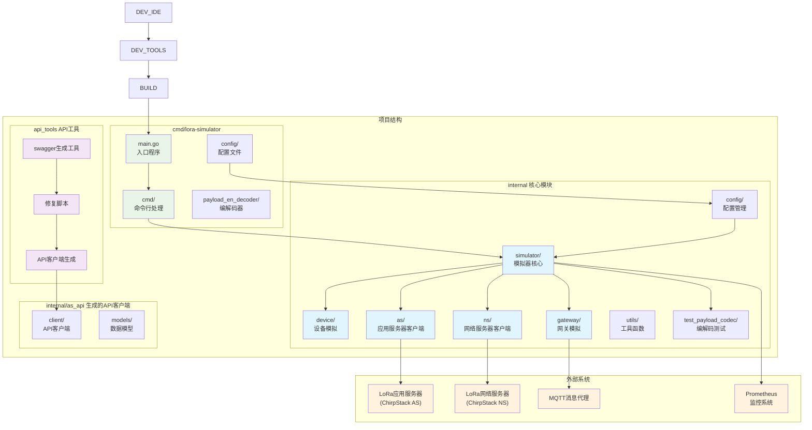
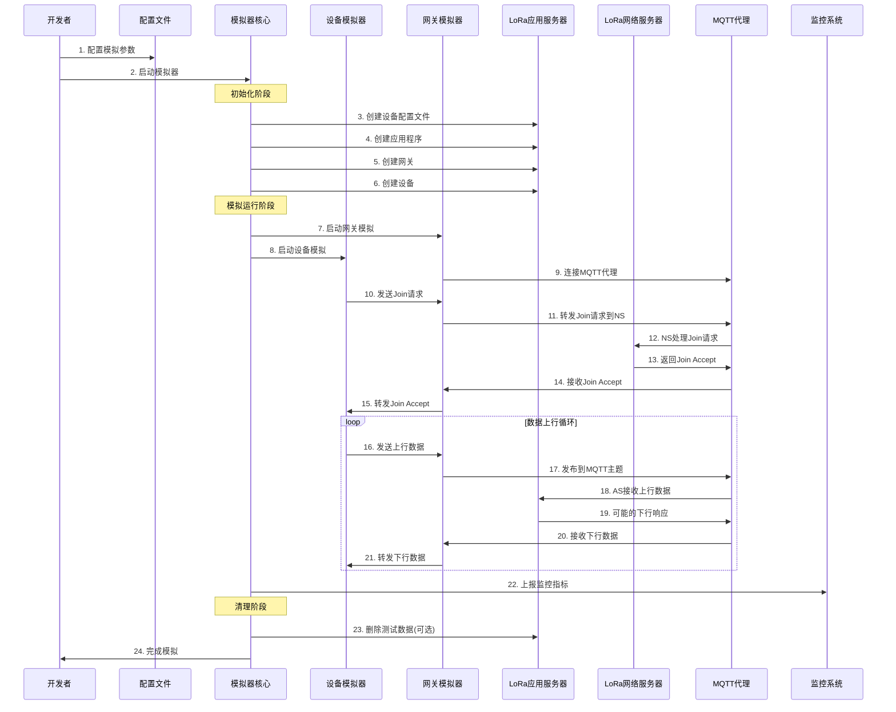

# LoRa-Simulator 架构与开发指南

## 项目概述

LoRa-Simulator 是一个用Go语言开发的LoRaWAN设备和网关模拟器，主要用于测试ChirpStack应用服务器的功能和性能。该项目可以模拟大量LoRaWAN设备的入网、数据上传、下发等场景，支持FUOTA（固件空中升级）、BACnet、Modbus等高级功能的测试。

## 项目GIT信息
- 项目地址：https://gitlab.milesight.com/iot/gateway/lora-server/lora-simulator
- 项目分支：D1-UGXX
  - 分支说明：D1-UGXX 目前仅适配UG56和UG6X的API

## 核心架构

### 整体架构图



### 数据流程图



## 模块详细说明

### 1. 核心模块 (internal/)

#### 1.1 模拟器核心 (simulator/)
- **文件**: `simulator.go`
- **功能**: 
  - 模拟器的主要控制逻辑
  - 管理设备和网关的生命周期
  - 协调各个组件的初始化和清理
  - 支持BACnet、FUOTA、Modbus等高级功能测试
- **关键结构体**: `Simulation`
- **主要方法**:
  - `Start()`: 启动模拟器
  - `init()`: 初始化设置（网关、设备配置文件、应用程序等）
  - `runSimulation()`: 执行模拟逻辑
  - `tearDown()`: 清理资源

#### 1.2 设备模拟 (device/)
- **文件**: `device.go`
- **功能**:
  - 模拟LoRaWAN OTAA设备行为
  - 处理设备入网流程（Join Request/Accept）
  - 模拟设备数据上传和下行数据接收
  - 支持动态负载编码
- **关键特性**:
  - 支持OTAA激活方式
  - 可配置上行间隔和负载
  - 支持确认和非确认帧
  - 集成负载编解码器

#### 1.3 网关模拟 (gateway/)
- **文件**: `gateway.go`
- **功能**:
  - 模拟LoRaWAN网关行为
  - 处理设备与网络服务器之间的通信
  - 通过MQTT协议与网络服务器交互
  - 支持多种频率计划（EU868、AS923、CN470等）
- **主要功能**:
  - 上行数据转发
  - 下行数据分发
  - 网关状态上报

#### 1.4 应用服务器客户端 (as/)
- **文件**: `api_client.go`
- **功能**:
  - 与ChirpStack应用服务器API交互
  - 管理应用程序、设备配置文件、设备等资源
  - 支持BACnet和Modbus功能
  - 处理FUOTA任务
- **主要操作**:
  - 创建/删除应用程序
  - 创建/删除设备配置文件
  - 批量创建/删除设备
  - 管理负载编解码器

#### 1.5 配置管理 (config/)
- **文件**: `config.go`
- **功能**: 统一管理配置参数
- **配置项包括**:
  - 应用服务器连接信息
  - MQTT代理设置
  - 模拟器参数（设备数量、上行间隔等）
  - 测试功能开关

### 2. 命令行工具 (cmd/lora-simulator/)

#### 2.1 主程序 (main.go)
- 程序入口点
- 设置日志输出
- 调用命令行处理模块

#### 2.2 命令行处理 (cmd/)
- **root.go**: 定义根命令和全局参数
- **root_run.go**: 主要运行逻辑，包含启动任务序列
- **configfile.go**: 配置文件操作

#### 2.3 负载编解码器 (payload_en_decoder/)
- 支持多厂商设备的负载编解码
- JavaScript编解码脚本
- 测试数据和用例

### 3. API工具链 (api_tools/)

#### 3.1 API客户端生成流程
1. **swagger生成**: 从LoRa应用服务器生成swagger文档
2. **修复脚本**: 修复swagger文档中的问题
3. **格式转换**: 转换为驼峰命名格式
4. **客户端生成**: 使用go-swagger生成Go客户端代码

#### 3.2 工具脚本说明
- `generate_api_client.sh`: 主要生成脚本
- `fix_mixin_operation_id.py`: 修复操作ID重复问题
- `convert_swagger_to_camel_case.py`: 转换命名格式

## 开发流程

### 1. 环境准备

#### 1.1 依赖安装
```bash
# Go环境要求
go version # 要求Go 1.23.0+

# 工具依赖
go install github.com/go-swagger/go-swagger/cmd/swagger@latest
pip3 install pyyaml
```

#### 1.2 项目克隆和构建
```bash
git clone <项目地址>
cd lora-simulator
make build
```

### 2. 配置设置

#### 2.1 主要配置文件
配置文件位于 `cmd/lora-simulator/config/lora-simulator.toml`

#### 2.2 关键配置项
```toml
[lora-simulator.api]
server = "192.168.40.148"           # 应用服务器地址
username = "admin"                  # 登录用户名
password = "password"               # 登录密码
is_lns = false                      # 是否为LNS模式
use_new_device = true               # 是否创建新设备
test_feature = "normal,modbus"      # 测试功能列表

[lora-simulator.integration.mqtt]
server = "tcp://192.168.40.148:1883" # MQTT代理地址
username = "lorawan"                # MQTT用户名
password = "Urs@L1nk#Ms2020"       # MQTT密码

[[simulator]]
tenant_id = "f6f7d81d-647f-4c7f-8409-3e5218c0c523"
duration = "0s"                     # 模拟持续时间
sequence_join = true                # 串行入网
sequence_join_interval = "2s"       # 入网间隔
sequence_device_number = 1          # 每批设备数

[simulator.device]
count = 5                           # 设备数量
uplink_interval = "300s"            # 上行间隔
f_port = 1                          # 端口号
payload = "010203"                  # 负载数据

[simulator.gateway]
min_count = 3                       # 最小网关数
max_count = 5                       # 最大网关数
```

### 3. API客户端更新流程

当LoRa应用服务器API发生变化时，需要重新生成客户端代码：

```bash
cd api_tools
./generate_api_client.sh /path/to/lora-app-server
```

### 4. 开发和测试

#### 4.1 本地开发
```bash
# 编译
make build

# 运行
cd cmd/lora-simulator
./lora-simulator -c config/lora-simulator.toml
```

#### 4.2 功能测试
模拟器支持多种测试模式：
- **normal**: 基本设备模拟
- **bacnet**: BACnet协议测试
- **fuota**: 固件空中升级测试
- **modbus**: Modbus协议测试

#### 4.3 负载编解码测试
```bash
# 启用编解码测试
[lora-simulator.test_payload_codec]
enable = true
test_case_file = "payload_en_decoder/编解码数据表.xlsx"
```

### 5. 监控和指标

#### 5.1 Prometheus指标
模拟器暴露以下监控指标：
- 设备入网成功/失败数
- 上行数据发送统计
- 下行数据接收统计
- 网关状态信息

#### 5.2 日志输出
所有日志输出到 `simulator.log` 文件，便于问题排查。

## 扩展开发

### 1. 添加新的测试功能

1. 在 `internal/simulator/simulator.go` 中添加新的设置方法
2. 更新配置结构体 `internal/config/config.go`
3. 在主运行逻辑中集成新功能

### 2. 支持新的设备类型

1. 在 `payload_en_decoder/codec-release/vendors/` 下添加厂商目录
2. 提供JavaScript编解码脚本
3. 更新设备配置文件

### 3. 扩展API客户端

1. 更新swagger文档
2. 运行API客户端生成脚本
3. 在 `internal/as/api_client.go` 中添加新的API调用方法

## 常见问题

### 1. 编译问题
- 确保Go版本满足要求（1.23.0+）
- 检查依赖包是否完整：`go mod tidy`

### 2. 连接问题
- 验证应用服务器地址和端口
- 检查MQTT代理连接状态
- 确认用户名密码正确

### 3. 设备入网失败
- 检查设备配置文件是否正确创建
- 验证网关是否正常启动
- 查看日志文件排查具体错误

### 4. API客户端生成失败
- 确保swagger工具已正确安装
- 检查LoRa应用服务器路径是否正确
- 验证Python依赖是否安装

